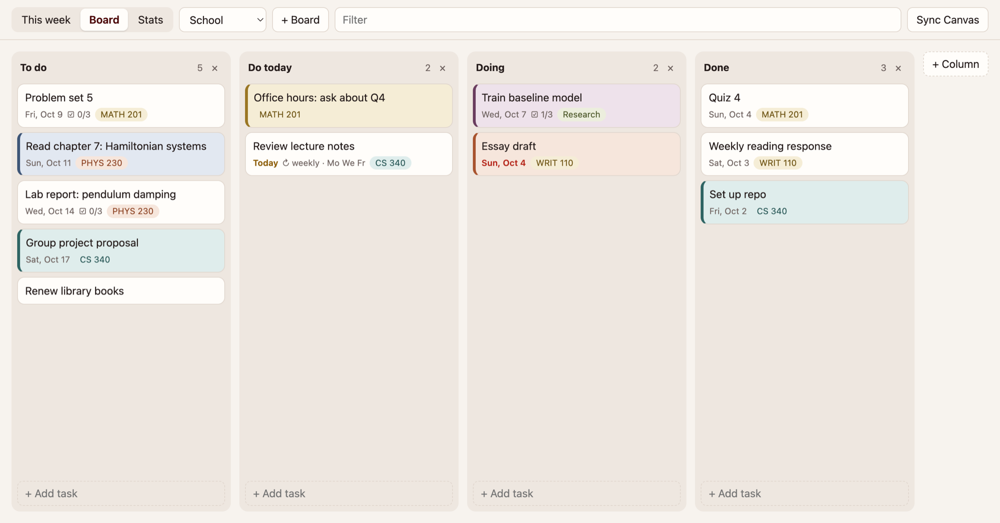
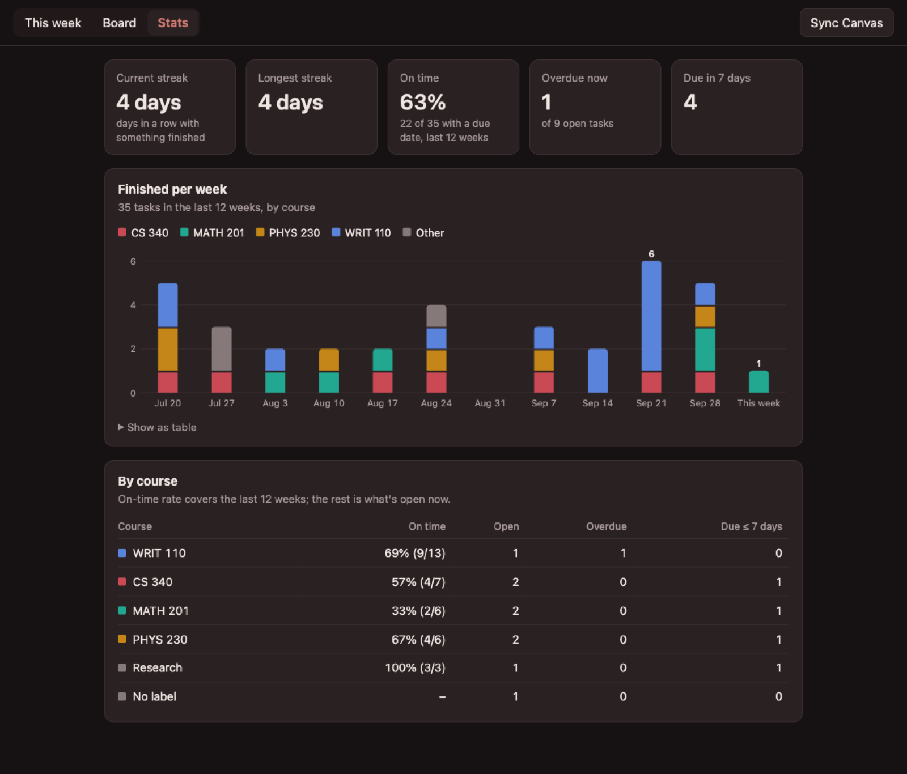

# Pierog

A small kanban board that runs on your own machine. Type `pierog`, and it opens in your browser.

- Board, "This week" and Stats views; drag-and-drop between columns (mouse and touch)
- Subtasks, labels, due dates, card colors, recurring tasks
- Canvas LMS sync: imports upcoming assignments from your Canvas calendar feed
- An [MCP](https://modelcontextprotocol.io) server, so Claude (or any MCP client) can read and edit the board



<details>
<summary>Stats view (dark mode)</summary>



</details>

Everything is stored in one SQLite file in `~/.pierog`. Nothing leaves your machine except the Canvas feed request.

## Requirements

Node.js 26 or newer. No database or build step: Node runs the TypeScript directly and has SQLite built in.

Tested on macOS. Linux should work; Windows is untested. On macOS, `pierog set-canvas` reads the clipboard; elsewhere, pipe the link in.

## Install

```sh
git clone https://github.com/djadczak956/pierog.git
cd pierog
npm install
npm link          # puts the `pierog` command on your PATH
```

## Use

```sh
pierog            # start in the background if needed and open http://localhost:4747
pierog status     # running? where is the data?
pierog stop
pierog sync       # import Canvas assignments now
```

Every `pierog` launch syncs Canvas first (when a feed is set), and the server syncs again every 6 hours while it runs.

The server keeps running after you close the terminal, so MCP clients can reach it. Stop it with `pierog stop`.

For a standalone window, use your browser's "Install app" (Chrome) or File → "Add to Dock" (Safari).

## Canvas sync

In Canvas, open **Calendar → Calendar Feed** and copy the link. Then run:

```sh
pierog set-canvas     # macOS reads the link from the clipboard; elsewhere: pierog set-canvas < file
```

The link works like a password, so it's never passed on the command line or printed. It's saved to `~/.pierog/config.json` (readable only by you).

Assignments land in the first column of a board named "School" (see `canvasBoard` below), labeled with the course code. A deleted assignment task isn't re-imported. If Canvas changes a due date, the task's date follows.

## Connect Claude Code

```sh
claude mcp add --scope user --transport http kanban http://localhost:4747/mcp
```

Tools: `list_boards`, `get_board`, `create_board`, `add_column`, `search_tasks`, `create_task`, `update_task`, `move_task`, `delete_task`, `add_subtasks`, `update_subtask`, `delete_subtask`, `get_stats`, `sync_canvas`.

## Configuration

`~/.pierog/config.json` (created on demand):

| Key | Default | |
|---|---|---|
| `port` | `4747` | |
| `canvasBoard` | `"School"` | board Canvas assignments go to |
| `canvasIcsUrl` | `null` | set with `pierog set-canvas` |
| `timezone` | system | IANA name, e.g. `"America/New_York"`; decides what "today" is |

Set `PIEROG_HOME` to keep data somewhere other than `~/.pierog`.

## Security

The server listens on `127.0.0.1` only and has no login. It rejects requests whose `Host` or `Origin` isn't localhost, so a website open in your browser can't reach it. Anyone with a shell on your machine can.

## Development

```sh
npm start         # run the server in the foreground
npm test          # unit + end-to-end tests (throwaway data dir, never touches ~/.pierog)
npm run check     # typecheck
```

Schema changes go in `migrations/NNNN_name.sql`; they're applied in order on startup.

## Credits

Drag and drop by [SortableJS](https://github.com/SortableJS/Sortable) (MIT), bundled in `public/vendor/`.

## License

[MIT](LICENSE)
